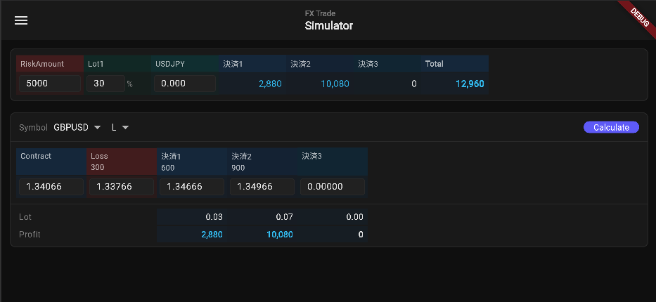
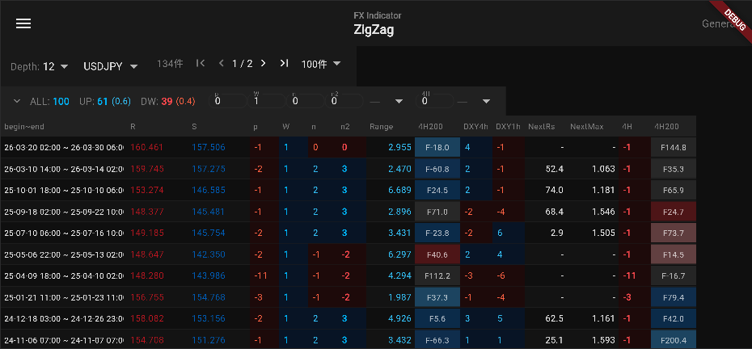
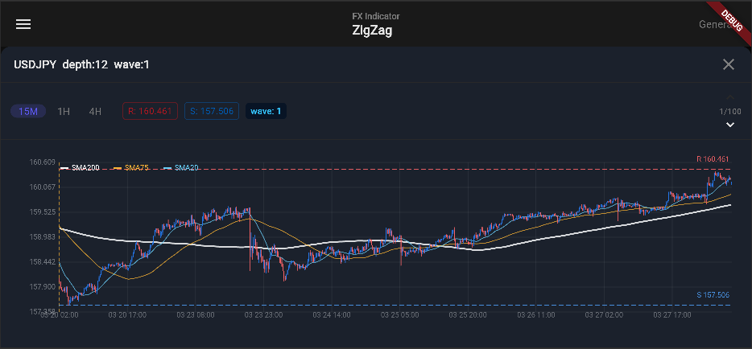
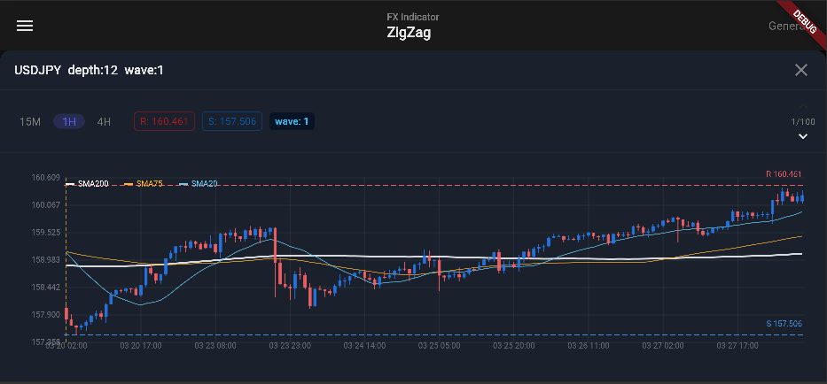
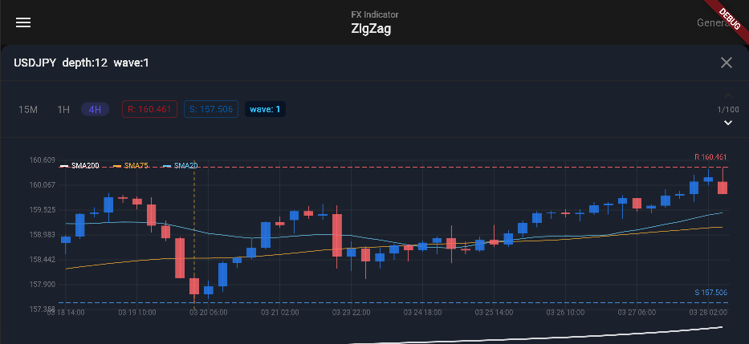

# sandbox-app-flutter


FX トレード支援を目的とした Flutter モバイルアプリ。  
AWS Cognito（RS256 JWT）による認証と多段階のルートガードを実装し、  
`sandbox-api-springboot` との通信を専用レイヤーに集約することで関心の分離を実現。  
Provider パターンによる状態管理と StatefulWidget ローカル state を使い分け、シンプルかつ保守性の高い設計を採用。

---

## スクリーンショット

### トレードシミュレーター



### ZigZag 分析






---

## アーキテクチャ

### ディレクトリ構成

```
lib/
├── config/          # 環境変数（API_BASE_URL など）
├── models/          # ドメインモデル（JSON シリアライズ含む）
├── services/        # API クライアント（JWT 自動付与）
├── providers/       # 状態管理（ChangeNotifier）
│   ├── auth_provider.dart
│   └── simulator_provider.dart
├── screens/         # 画面（StatefulWidget）
│   ├── login/
│   ├── user/        # ユーザー登録・プロフィール
│   └── fx/
│       ├── simulator/           # トレードシミュレーター
│       ├── bar_data/            # バーデータ管理
│       ├── economic_indicator_data/  # 経済指標データ
│       └── zigzag/              # ZigZag 分析・生成
├── theme/           # カラーテーマ定義
└── widgets/         # 共通ウィジェット（AppDrawer, SearchPager など）
```

**依存方向**: screens → providers / services → models

### 認証フロー

```
サインイン (Cognito Amplify)
  └─ JWT 取得 → AuthProvider 保持
       └─ sandboxUser 取得 (API /v1/auth/login)
            ├─ 未登録      → /user/registration（登録フロー）
            ├─ 承認待ち    → /pending-approval
            ├─ ブロック    → /error/blocked
            └─ 承認済み    → 一般画面へ
```

JWT の claims は `JsonWebClaims` の `[]` 演算子非対応のため、  
raw トークンを Base64 デコードして手動パース（`auth_provider.dart`）。

---

## 主な機能

| ドメイン | 主な機能 |
|---|---|
| **認証 / Auth** | Cognito サインイン・JWT 自動付与・サインアウト |
| **ユーザー / User** | 初回登録フロー・プロフィール編集（ニックネーム変更） |
| **FX バーデータ** | OHLC バーデータ一覧（Trade / Analyze シンボル切替） |
| **FX 経済指標データ** | 経済指標データ一覧・検索 |
| **FX ZigZag 分析** | ZigZag 一覧・フィルタ・チャートモーダル・生成（管理者） |
| **トレードシミュレーター** | リスク額・ロット比率・エントリーに基づくシミュレーション |

---

## 技術スタック

| カテゴリ | ライブラリ / ツール |
|---|---|
| UI フレームワーク | Flutter 3 |
| 言語 | Dart 3 |
| 状態管理 | Provider 6 |
| HTTP クライアント | http 1.2 |
| 認証 | AWS Amplify Flutter v2 (Cognito) |
| Linter | flutter_lints 6 |

---

## Getting Started

### 0. 前提条件（Claude Code利用時）

`$SANDBOX_HOME` 直下に `claude-code`（横断仕様ドキュメントフォルダ、Google Driveへのシンボリックリンク）が必要です。`CLAUDE.md` の `@../claude-code/...` importの解決に使用されます。

### 1. 環境変数の設定

`.env.json` をプロジェクトルートに作成し、以下を記入：

```json
{
  "COGNITO_POOL_ID": "ap-northeast-1_XXXXXXXXX",
  "COGNITO_APP_CLIENT_ID": "XXXXXXXXXXXXXXXXXXXXXXXXXX",
  "COGNITO_REGION": "ap-northeast-1",
  "API_BASE_URL": "http://localhost:8080"
}
```

### 2. 起動

```bash
# Android 実機
flutter run -d <device-id> --dart-define-from-file=.env.json

# Chrome（CORS 無効化）
flutter run -d chrome \
            --web-browser-flag "--disable-web-security" \
            --dart-define-from-file=.env.json

# 静的解析
flutter analyze

# デバイス一覧
flutter devices
```

---

## API 通信

`lib/services/api_service.dart` で HTTP クライアントを生成し、  
Cognito の JWT トークン（ID Token）をリクエストヘッダーに自動付与する。  
`returnCode !== 0` はビジネスエラーとして例外スローし、各画面でハンドリングする。

---

## ドキュメント

| 内容 | ファイル |
|---|---|
| 画面・Widget 仕様（ルート・API・Props） | [docs/widgets.md](docs/widgets.md) |
| バックエンド API 仕様 | [docs/api-docs.yaml](docs/api-docs.yaml) |
